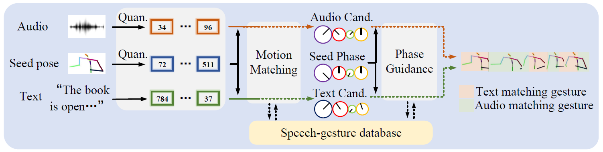

# QPGesture: Quantization-Based and Phase-Guided Motion Matching for Natural Speech-Driven Gesture Generation

### [Conference archive](https://openaccess.thecvf.com/content/CVPR2023/papers/Yang_QPGesture_Quantization-Based_and_Phase-Guided_Motion_Matching_for_Natural_Speech-Driven_Gesture_CVPR_2023_paper.pdf) | [Arxiv](https://arxiv.org/abs/2305.11094) | [Demo](https://www.youtube.com/watch?v=AVqHhnVmGlU) | [Presentation Video](https://www.youtube.com/watch?v=5GKjFclT618)

<div align=center>

</div>

### Further Work

📢 [DiffuseStyleGesture](https://github.com/YoungSeng/DiffuseStyleGesture)/[DiffuseStyleGesture+](https://github.com/YoungSeng/DiffuseStyleGesture/tree/master/BEAT-TWH-main) - Based on the diffusion model, the full body gesture.
📢 [UnifiedGesture](https://github.com/YoungSeng/UnifiedGesture) - Training on multiple gesture datasets, refine the gestures.

## 1. Environment Settings

This code was tested on `NVIDIA GeForce RTX 2080 Ti` and requires `conda or miniconda`.

<!--# cd /ceph/hdd/yangsc21/Python/QPG/-->
```angular2html
conda create -n QPGesture python=3.7
conda activate QPGesture
pip install torch==1.8.0+cu111 -f https://download.pytorch.org/whl/torch_stable.html
pip install -r requirements.txt 
```

## 2. Quick Start

Download our processed database and pre-trained models from [Tsinghua Cloud](https://cloud.tsinghua.edu.cn/f/0f40065da78648f69b6e/) or [Google Cloud](https://drive.google.com/file/d/1h_nIGGDYvsSO5kh--eBzyRNxnuBOqDif/view?usp=sharing) and place them in the `data` fold and `pretrained_model` fold in the project path.

```angular2html
cd ./codebook/Speech2GestureMatching/
bash GestureKNN.sh
```
This is an audio clip about 24 seconds long and it takes about 5 minutes to match.
You will get the results in `./codebook/Speech2GestureMatching/output/result.npz`

```angular2html
cd ..
python VisualizeCodebook.py --config=./configs/codebook.yml --gpu 0 --code_path "./Speech2GestureMatching/output/result.npz" --VQVAE_model_path "../pretrained_model/codebook_checkpoint_best.bin" --stage inference
```

Then you will get `.bvh`, `.mp4` and other intermediate files in `.codebook/Speech2GestureMatching/output/knn_pred_wavvq/`

https://github.com/YoungSeng/QPGesture/assets/37477030/0ee4bab2-056c-4dd1-b35f-6c125efaaf4e

You can use [Blender](https://www.blender.org/) to visualize bvh file.

https://github.com/YoungSeng/QPGesture/assets/37477030/d554f634-04e6-4f7e-8cb8-5f382af282a1

We also provide a processed database for speaker id `1`, available for download in [Tsinghua Cloud](https://cloud.tsinghua.edu.cn/f/c9401c6c0142480f826a/) and [Baidu Cloud](https://pan.baidu.com/s/1g3tN7c9KDfbhiJ-ET2jfmQ?pwd=q9ub). It is optional to use this database. We recommend trying Speaker `1`, which has a larger database and better performance.

## 3. Test your own audio

Here, we need to build the test set. We use `./data/Example3/4.wav` as an example. Note that no text is used here.

Download `vq-wav2vec Gumbel` from [fairseq](https://github.com/facebookresearch/fairseq/blob/main/examples/wav2vec/README.md#vq-wav2vec)
and put it in `./process/`.
Modify the code of `fairseq` in conda or miniconda according to this [issue](https://github.com/facebookresearch/fairseq/issues/3256).

Then run:
```angular2html
cd ./process/
python make_test_data.py --audio_path "../data/Example3/4.wav" --save_path "../data/Example3/4"
```
You will get `./data/Example3/4/wavvq_240.npz`
Then similar to the previous step, just run the following code:
```angular2html
cd ../codebook/Speech2GestureMatching/
bash GestureKNN.sh "../../data/Example3/4/wavvq_240.npz" 0 "./output/result_Example3.npz"
```

## 4. Constructing database

Install [gentle](https://github.com/lowerquality/gentle) like [Trimodal](https://github.com/ai4r/Gesture-Generation-from-Trimodal-Context) to align the text and audio, this will take some minutes:
```angular2html
cd ./process/
git clone https://github.com/lowerquality/gentle.git
cd gentle
./install.sh
```

You can verify whether gentle is installed successfully with the following command:
```angular2html
python align.py './examples/data/lucier.mp3' './examples/data/lucier.txt'
```
Download the [WavLM Large](https://github.com/microsoft/unilm/tree/master/wavlm) and put it into `./pretrained_model/`.
Download the character you want to build from [BEAT](https://pantomatrix.github.io/BEAT/), you can put it in `./dataset/orig_BEAT/` or other places.
Here is an example of speaker id `10`:
```angular2html
python make_beat_dataset.py --BEAT_path "../dataset/orig_BEAT/speakers/" --save_dir "../dataset/BEAT" --prefix "speaker_10_state_0" --step 1
cd ../codebook/Speech2GestureMatching/
python normalize_audio.py
python mfcc.py
cd ../../process/
python make_beat_dataset.py --BEAT_path "../dataset/orig_BEAT/speakers/" --save_dir "../dataset/BEAT" --prefix "speaker_10_state_0" --step 2
```

Now we get a basic database and further we compute phase, wavlm and wavvq features:

```
cd ../codebook/
python PAE.py --config=./configs/codebook.yml --gpu 0 --stage inference
cd ../process/
python make_beat_dataset.py --config "../codebook/configs/codebook.yml" --BEAT_path "../dataset/orig_BEAT/speakers/" --save_dir "../dataset/BEAT" --prefix "speaker_10_state_0" --gpu 0 --step 3
python make_beat_dataset.py --config "../codebook/configs/codebook.yml" --BEAT_path "../dataset/orig_BEAT/speakers/" --save_dir "../dataset/BEAT" --prefix "speaker_10_state_0" --gpu 0 --step 4
```
Then you will get all the databases in `Quick Start`.

## 5. Train your own model

### Data preparation

This is just an example of speaker id `10`, in fact we use all speakers to train these models.

```angular2html
pip install numpy==1.19.5       # Unfortunately, we have been troubled with the version of the numpy library (with pyarrow).
python beat_data_to_lmdb.py --config=../codebook/configs/codebook.yml --gpu 0
```
Then you will get `data mean/std`, and you may copy them to `./codebook/configs/codebook.yml`.

### gesture VQ-VAE 

```angular2html
cd ../codebook/
python train.py --config=./configs/codebook.yml --gpu 0
```
The gesture VQ-VAE will saved in `./codebook/output/train_codebook/codebook_checkpoint_best.bin`.

For futher calculate the distance between each code, run

```angular2html
python VisualizeCodebook.py --config=./configs/codebook.yml --gpu 0 --code_path "./Speech2GestureMatching/output/result.npz" --VQVAE_model_path "./output/train_codebook/codebook_checkpoint_best.bin" --stage train
```

Then you will get the absolute pose of each code in `./codebook/output/code.npz` used in `Quick Start`.

### PAE

```angular2html
python PAE.py --config=./configs/codebook.yml --gpu 0 --stage train
```

The PAE will saved in `./codebook/output/train_PAE/PAE_checkpoint_best.bin`

## Reference

This work is highly inspired by [Bailando](https://github.com/lisiyao21/Bailando), [KNN](http://vcai.mpi-inf.mpg.de/projects/SpeechGestureMatching/) and [DeepPhase](https://github.com/sebastianstarke/AI4Animation).

## Citation

If you find this work useful, please consider cite our work with the following bibtex:

```
@inproceedings{yang2023QPGesture,
  author       = {Sicheng Yang and Zhiyong Wu and Minglei Li and Zhensong Zhang and Lei Hao and Weihong Bao and Haolin Zhuang},
  title        = {QPGesture: Quantization-Based and Phase-Guided Motion Matching for Natural Speech-Driven Gesture Generation},
  booktitle    = {{IEEE/CVF} Conference on Computer Vision and Pattern Recognition, {CVPR}},
  publisher    = {{IEEE}},
  month        = {June},
  year         = {2023},
  pages        = {2321-2330}
}
```

Please feel free to contact us [yangsc21@mails.tsinghua.edu.cn](yangsc21@mails.tsinghua.edu.cn) with any question or concerns.


